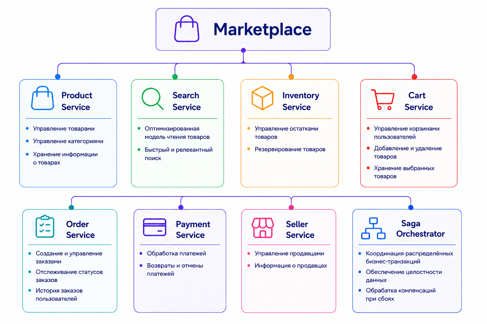
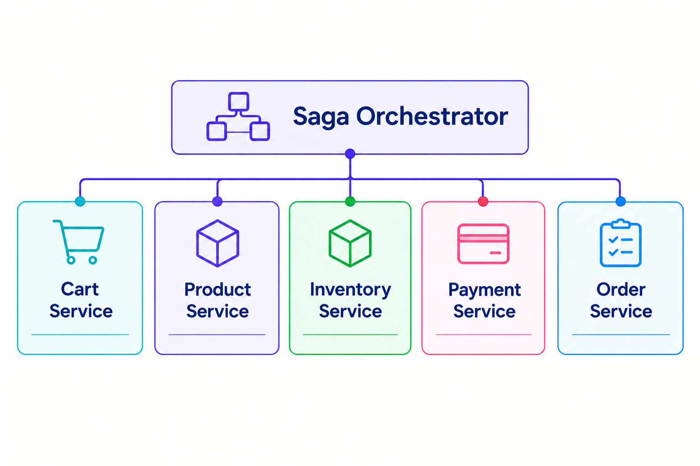

# Marketplace

> Микросервисная торговая платформа с событийной архитектурой, CQRS и распределёнными транзакциями на основе Saga Pattern.

**Marketplace** — сервис экосистемы Burkina, предназначенный для размещения, поиска и покупки товаров.

Приложение построено как набор независимых микросервисов, каждый из которых отвечает за свою предметную область.

Для взаимодействия между сервисами используются **Apache Kafka** и **gRPC**.

Архитектура Marketplace построена вокруг разделения операций **чтения и записи**, событийного взаимодействия и управления распределёнными бизнес-транзакциями с помощью **Saga Pattern**.

---

# 📖 О проекте

Marketplace предоставляет пользователям возможность:

- просматривать товары;
- искать товары;
- добавлять товары в корзину;
- оформлять заказы;
- оплачивать заказы;
- управлять товарами;
- управлять остатками;
- работать с продавцами.

Каждая бизнес-область изолирована в отдельном сервисе.

Основные компоненты системы:

- **Product Service** — управление товарами;
- **Search Service** — оптимизированная модель чтения товаров;
- **Inventory Service** — управление остатками товаров;
- **Cart Service** — управление корзинами;
- **Order Service** — управление заказами;
- **Payment Service** — обработка платежей;
- **Seller Service** — управление продавцами;
- **Saga Orchestrator** — координация распределённых бизнес-транзакций.

---

# 🏗️ Архитектура

Общая архитектура Marketplace представлена на диаграмме ниже:

---

# 🧩 Сервисы

---

## 📦 Product Service

**Product Service** отвечает за управление товарами и категориями.

Он является частью **модели записи (Write Model)**.

Основные задачи:

- создание и управление категориями;
- создание товаров;
- изменение товаров;
- удаление товаров;
- управление информацией о товаре;
- изменение состояния товара;
- публикация событий об изменениях товаров.

Product Service является источником истины для данных о товарах.

---

## 🔎 Search Service

**Search Service** представляет собой **модель чтения (Read Model)**.

Он получает события от других сервисов через **Apache Kafka** и формирует собственное оптимизированное представление товаров.

Основная задача Search Service — быстро предоставлять пользователю список товаров.

Read Model содержит всю необходимую информацию для отображения товаров без необходимости обращаться к нескольким сервисам.

Это позволяет:

- быстро получать список товаров;
- выполнять поиск;
- фильтровать товары;
- сортировать товары;
- выполнять пагинацию;
- не обращаться напрямую к Product Service при каждом запросе;

Таким образом, Search Service реализует **Read Model в рамках CQRS**.

---

## 📦 Inventory Service

**Inventory Service** отвечает за управление остатками товаров.

Основные задачи:

- хранение информации о количестве товара;
- изменение количества доступного товара;
- резервирование товара;
- освобождение резерва;
- подтверждение списания товара;

Inventory Service является отдельным владельцем данных об остатках.

---

## 🛒 Cart Service

Основные задачи:

- получение содержимого корзины;
- добавление товаров;
- удаление товаров;
- изменение количества товаров;
- очистка корзины;

Cart Service владеет собственным состоянием корзины.

---

## 📋 Order Service

**Order Service** отвечает за управление заказами.

Основные задачи:

- создание заказа;
- изменение состояния заказа;
- хранение информации о заказе;
- публикация событий жизненного цикла заказа.

Order Service является владельцем состояния заказа.

Создание заказа является распределённой бизнес-операцией и координируется через **Saga Orchestrator**.

---

## 💳 Payment Service

**Payment Service** отвечает за операции, связанные с оплатой заказов.

Основные задачи:

- создание платежа;
- обработка платежа;
- подтверждение оплаты;
- отмена платежа;
- хранение состояния платежа;

---

## 🏪 Seller Service

**Seller Service** отвечает за управление продавцами Marketplace.

Основные задачи:

- регистрация продавцов;
- управление информацией о продавце;
- управление статусом продавца;
- хранение данных продавца;
- публикация событий, связанных с продавцами.

Seller Service отделяет данные продавца от данных непосредственно о товарах.

---

## 🔄 Saga Orchestrator

**Saga Orchestrator** отвечает за координацию распределённых бизнес-транзакций.

Основной сценарий, для которого используется Saga, — **создание заказа**.

Создание заказа затрагивает несколько независимых сервисов:

Поскольку каждый сервис имеет собственную базу данных, невозможно использовать одну общую ACID-транзакцию между всеми компонентами.

Вместо этого используется **Saga Pattern**.

---

# 🔄 Создание заказа

Процесс создания заказа реализован с использованием **Saga Pattern** и координируется сервисом **Saga Orchestrator**.

После начала оформления заказа **Saga Orchestrator** сначала получает содержимое корзины пользователя через **Cart Service**. Затем выполняется проверка товаров через **Product Service** — проверяется существование товаров, их доступность и актуальная стоимость.

После успешной проверки товаров оркестратор инициирует их резервирование через **Inventory Service**. Если все необходимые товары успешно зарезервированы, выполняется оплата заказа через **Payment Service**.

Только после успешного резервирования товаров и выполнения оплаты **Saga Orchestrator** создаёт заказ в **Order Service**. После успешного создания заказа основные этапы **Saga** считаются завершёнными, после чего корзина пользователя очищается через **Cart Service**.

Каждый этап **Saga** представляет собой отдельную локальную транзакцию внутри соответствующего сервиса. Таким образом, единая распределённая операция разбивается на последовательность независимых транзакций между несколькими микросервисами.

Если один из этапов завершается ошибкой, **Saga Orchestrator** запускает соответствующие компенсирующие операции для уже выполненных действий. Например, если оплата не была выполнена после успешного резервирования товаров, оркестратор освобождает резерв в **Inventory Service**. При необходимости выполняются компенсации других ранее завершённых операций.

Такой подход позволяет корректно обрабатывать частично выполненные распределённые операции без использования общей транзакции между базами данных различных сервисов.

---

# 📨 Взаимодействие сервисов

Сервисы Marketplace используют два основных механизма взаимодействия:

- **Apache Kafka** — асинхронное взаимодействие и события;
- **gRPC** — синхронное взаимодействие между сервисами.
  Apache Kafka

### Apache Kafka

Kafka используется для:

- публикации событий;
- асинхронного взаимодействия;
- синхронизации Read Model;
- взаимодействия между независимыми сервисами;
- передачи событий Saga.

### gRPC

gRPC используется для **Saga Pattern** и случаев, когда сервису необходимо получить синхронный ответ от другого сервиса. Например, проверить существование товара перед добавлением его в корзину.

Это позволяет использовать RPC-вызовы там, где асинхронное взаимодействие через Kafka не подходит.

---

# 🧱 Архитектурные паттерны

В проекте используются следующие архитектурные и интеграционные паттерны:

| Паттерн                        | Назначение                                                                        |
|--------------------------------|-----------------------------------------------------------------------------------|
| **Microservices Architecture** | Разделение системы на независимые сервисы                                         |
| **Event-Driven Architecture**  | Взаимодействие сервисов через события                                             |
| **CQRS**                       | Разделение моделей чтения и записи для удобного и быстрого получения списка чатов |
| **Transactional Outbox**       | Гарантированная публикация событий в Kafka                                        |
| **Database per Service**       | Каждый сервис имеет свою базу данных для независимости и отказоустойчивости       |
| **Saga Pattern**               | Управление распределёнными бизнес-транзакциями                                    |
| **Synchronous RPC**            | Синхронное взаимодействие через gRPC                                              |

---

# 🛠️ Технологический стек

| Технология        | Назначение                                    |
|-------------------|-----------------------------------------------|
| **Java 21**       | Основной язык разработки                      |
| **Spring Boot 3** | Основной фреймворк                            |
| **REST API**      | Взаимодействие с клиентами                    |
| **PostgreSQL**    | Хранение данных                               |
| **Apache Kafka**  | Событийное и асинхронное взаимодействие       |
| **gRPC**          | Синхронное взаимодействие между сервисами     |
| **Docker**        | Контейнеризация сервисов                      |
